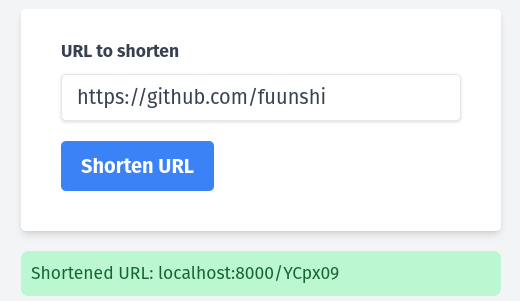
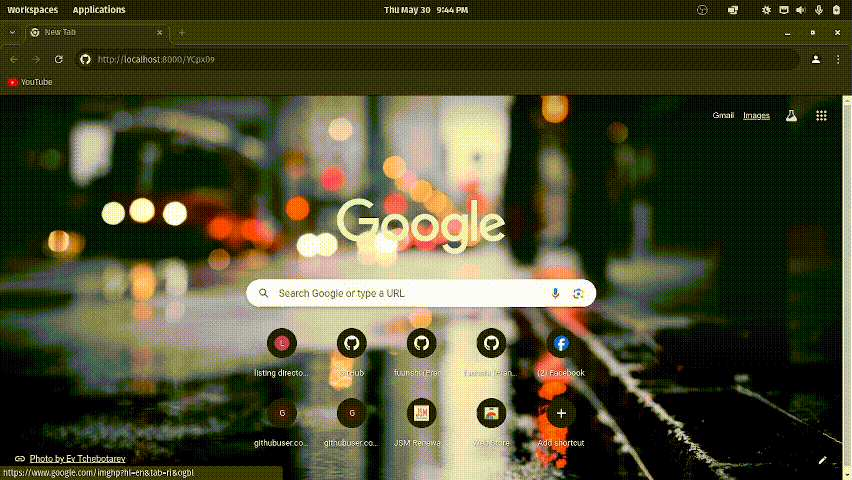

# URL Shortener with FastAPI and MySQL

This is a simple URL shortener application built with FastAPI and MySQL. The application allows users to input a long URL and receive a shortened version of that URL, which can then be used to redirect to the original long URL.

## Prerequisites

Before you begin, make sure you have the following prerequisites installed and configured:

- **MySQL Server**: Make sure you have a MySQL server running locally or accessible from your environment. You can install MySQL Server from the [official website](https://dev.mysql.com/downloads/mysql/).
- **MySQL Client**: You will need a MySQL client to interact with the MySQL server. You can use the MySQL Command-Line Client or any other MySQL client of your choice.
- **Database Configuration**: Create a new MySQL database and user for the URL shortener application. Make sure to grant appropriate permissions to the user for the new database.

## Configuration

Once you have MySQL server and client installed and configured, you need to update the `database.py` script with your MySQL connection details. Open `database.py` and replace the following placeholders with your actual MySQL connection details:

- `host`: The hostname or IP address of your MySQL server.
- `user`: The username of the MySQL user with access to the new database.
- `password`: The password of the MySQL user.
- `database`: The name of the new MySQL database.

Here's an example of how the `createConn` function might look after configuration:

```python
def createConn():
    try:
        conn = connect(
            host="your-mysql-server-hostname",
            user="your-mysql-username",
            password="your-mysql-password",
            database="your-mysql-database"
        )
        return conn
    except Error as err:
        print(f"Error: {err}")
```

## Features

- URL Shortening: Users can input a long URL and receive a shortened version of that URL.
- URL Redirection: Users can use the shortened URL to redirect to the original long URL.

## How to Use

1. Clone this repository:

   ```sh
   git clone https://github.com/fuunshi/url-shortener.git
   ```

2. Install the dependencies:

   ```sh
   pip install -r requirements.txt
   ```

3. Run the application:

   ```sh
   uvicorn main:app --reload
   ```

4. Navigate to `http://localhost:8000` in your web browser to access the application.

## Example Usage

### Screenshot


### GIF


## Built With

- [FastAPI](https://fastapi.tiangolo.com/) - A modern, fast (high-performance), web framework for building APIs with Python 3.7+.
- [MySQL](https://www.mysql.com/) - A popular open-source relational database management system.

## License

This project is licensed under the MIT License - see the [LICENSE](LICENSE) file for details.

## Authors

- **Pranil Shrestha** - [fuunshi](https://github.com/fuunshi)

---